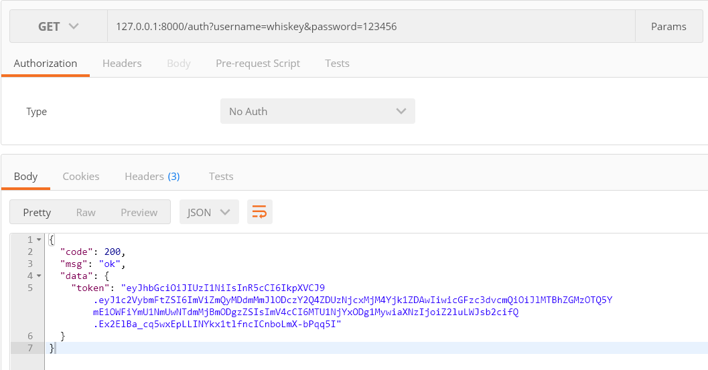

# 前端

  

  

  

# 后端

* ## **整体流程**  

* ## **RESTful API**   
>  一种软件架构风格、设计风格，而不是标准，只是提供了一组设计原则和约束条件。

* ## **一些问题**
    ### **1.Token**
    * 为什么要生成Token?
    * 项目生成Token的方法
        >服务器生成一个密钥，使用HS256对客户端信息进行加密生成Token，并将生成的Token返回给客户端，客户端之后每次访问服务端都携带此Token，服务端解析Token得到用户的相关信息。
        
    ### **2.数据库设计**